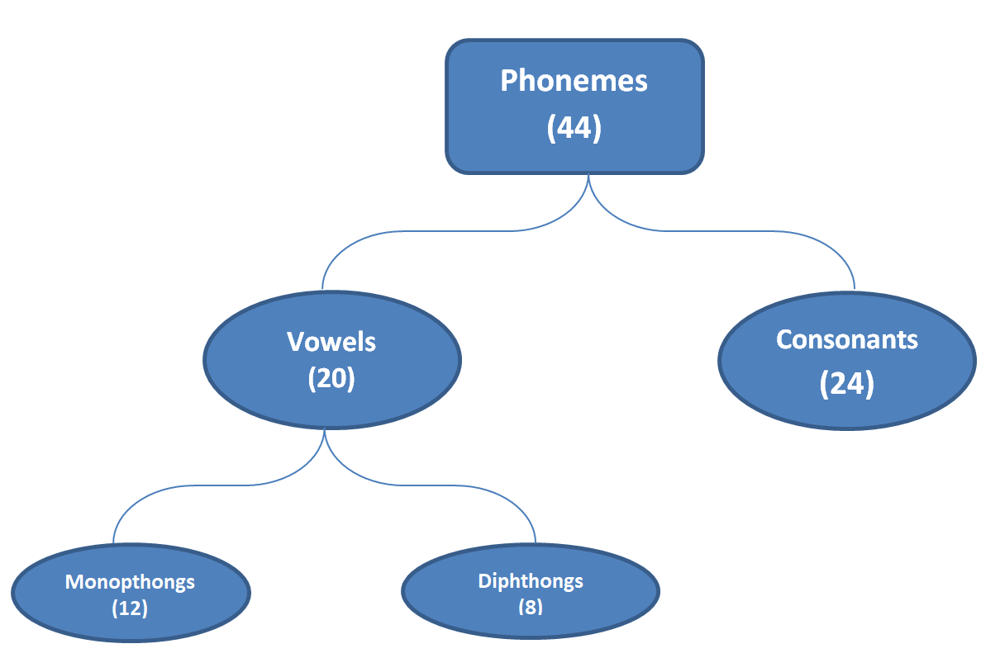
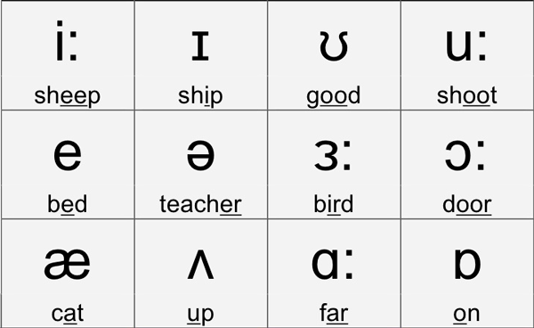
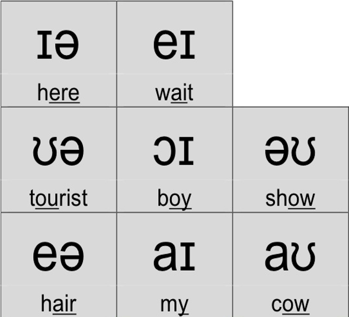
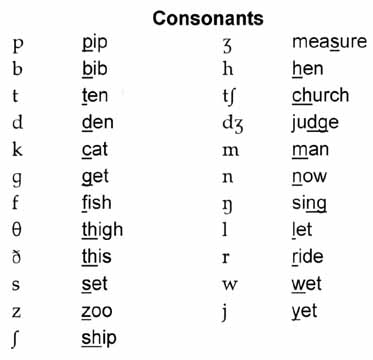

 

            <h3 style="font-weight: 1200;"> Theory:</h3>
                
Phonetics is a branch of linguistics that studies the sounds of human speech.  The term ‘phoneme’ refers to a unit of a sound that distinguishes one word from another.
                   English has 44 phonemes (distinctive sounds). 
                  Example: ‘Pit’ and ‘Kit’ are different because of the phonemes /P/ and /K/.  
                  Phonemic symbols are reliable guide to English Pronunciation. Knowledge of these symbols is useful in referring to a dictionary to find out the pronunciation of a word.

                
The International Phonetic Alphabet (IPA) is an alphabetic system of phonetic notation based primarily on the Latin alphabet. 
                      It was devised by the International Phonetic Association in the late 19th century as a standardized representation of the sounds of spoken language.

                
                
The phonemic symbols are kept in slant bars (/ /) and the visual representation of phonetic symbol is known as Phonetic transcription example: That is transcribed as / ðæt/, Many is transcribed as /meni/.
                        Allophone refers to the variant of a phoneme.  A phoneme may have a number of variants.  For example: Allophones of /t/   ट in top, tell, tray, tool.
                                Allophones of /K/   क in cap, cut, come, keep.  
                        These phonemes are classified into vowels and consonants.  
                

                <h5>Vowels:</h5>
                
A vowel sound is produced without the stoppage of air. Air comes out from the mouth without friction. 
                    For example while speaking ‘Art’ air escapes freely and continuously without any friction while pronouncing the first sound AH. 

                    
                <h6>Monophthongs</h6>
                
These are also known as pure vowels. They are further classified as Long Vowels and Short Vowels

                
                <h6>Diphthongs</h6>
                
These are the combination of two short vowels.

                
                <h5>consonants</h5>
                
A consonant sound is articulated with complete or partial closure of the vocal tract. 
                    For example: Examples /p/ is pronounced with the help of lips and there is a blockage of air while pronouncing it. 

                    
            

        </section>
    

